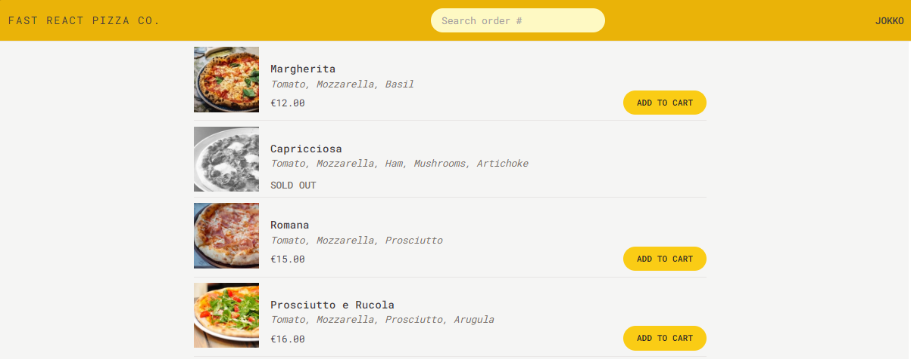

# Fast React Pizza 



A modern React-based pizza ordering application built with the latest web technologies.

## Features

- Real-time pizza menu browsing
- Cart management with Redux Toolkit
- Responsive design with Tailwind CSS
- Client-side routing with React Router
- Modern and intuitive user interface

## Tech Stack

- React 18
- Redux Toolkit for state management
- React Router for navigation
- Tailwind CSS for styling
- Vite as build tool
- ESLint and Prettier for code quality

## Getting Started

### Prerequisites

- Node.js (Latest LTS version recommended)
- npm or yarn package manager

### Installation

1. Clone the repository
2. Install dependencies:
```bash
npm install
```

### Development

Run the development server:
```bash
npm run dev
```

The app will be available at `http://localhost:5173`

### Building for Production

Create a production build:
```bash
npm run build
```

Preview the production build:
```bash
npm run preview
```

## Project Structure

- `/src` - Application source code
  - `/features` - Feature-based components and logic
  - `/services` - API and external service integrations
  - `/ui` - Reusable UI components
  - `/utils` - Utility functions and helpers

## Scripts

- `npm run dev` - Start development server
- `npm run build` - Create production build
- `npm run preview` - Preview production build
- `npm run lint` - Run ESLint for code quality